# Kế Hoạch Cải Thiện Toàn Diện Codebase `bamboo_core`

> **Mục tiêu**: Đánh giá hiện trạng so với tiêu chuẩn trong [RUST.md](file:///home/nguien/Documents/Code/Rust/bamboo_core/RUST.md) và [RUST_PERFORMACE.md](file:///home/nguien/Documents/Code/Rust/bamboo_core/RUST_PERFORMACE.md), xác định các điểm nghẽn về kiến trúc, bộ nhớ, an toàn (`unsafe`), API ergonomics và kiểm thử; từ đó lập lộ trình cải tiến có hệ thống (Planning Phase).

---

## 1. Bảng Tổng Hợp Hiện Trạng & Đánh Giá Đối Soát

| Tiêu Chí Đánh Giá | Hiện Trạng Trong `bamboo_core` | Tiêu Chuẩn `RUST.md` & `RUST_PERFORMACE.md` | Đánh Giá & Rủi Ro |
|---|---|---|---|
| **Hotpath Allocation** | `engine.output()` trả về `Cow::Owned(String)` mỗi phím gõ | 0 Heap Allocations trên toàn bộ hotpath | ⚠️ Cần khắc phục: Frontend gọi `output()` mỗi phím đang bị cấp phát heap liên tục |
| **Kích thước Struct** | [`Transformation`](file:///home/nguien/Documents/Code/Rust/bamboo_core/src/engine.rs#L46-L56) = **28 bytes** (chứa toàn bộ `Rule` 24 byte) | Hướng dẫn ghi 16 bytes; struct cần compact nhất có thể | ⚠️ [`Engine`](file:///home/nguien/Documents/Code/Rust/bamboo_core/src/engine.rs#L154) phình to ~10 KB trên stack do `snapshots` chiếm 7.4 KB |
| **Unsafe Code** | Có unsafe trong `push_char_fast` và `dfa::get_transition` | "Safe First", "Unsafe is not faster", không viết unsafe thừa | ❌ Vi phạm: `push_char_fast` hoàn toàn thừa; SWAR trong DFA có thể viết 100% Safe Rust |
| **Module Naming** | Tồn tại cả `src/utils.rs` và `src/bamboo_util.rs` | "Avoid Utils", "One Module = One Responsibility", đặt tên theo domain | ⚠️ Vi phạm quy ước kiến trúc: nên đổi thành `phonetics.rs` và `syllable.rs` |
| **Type Safety & Enums** | Dùng `flags: u32` xuyên suốt `bamboo_util.rs`, `&str` cho tên charset | "The Type System is Your First Line of Defense", "Primitive Obsession" | ⚠️ Dùng số nguyên và chuỗi thô dễ gây lỗi chính tả âm thầm (silent fallback) |
| **Khởi Tạo Cấu Hình** | `InputMethod::telex()` parse chuỗi `phf_map` tại runtime mỗi lần gọi | "Standard Library First", "LazyLock / OnceLock", tái sử dụng dữ liệu tĩnh | ⚠️ Tốn chi phí parse chuỗi và cấp phát 5 `Vec` mỗi lần khởi tạo |
| **Test & Bench CI** | `cargo test --all-targets` chạy cả benchmark 500k vòng lặp | "Test Speed", benchmark tách biệt với test thông thường | ❌ Gây lag CI/local: test debug chạy mất hàng chục giây đến phút |

---

## 2. Chi Tiết Các Điểm Cần Cải Thiện Theo Từng Trục

```mermaid
graph TD
    Root["Cải Thiện Bamboo Core"] --> P1["1. Bộ Nhớ & Hotpath (Performance)"]
    Root --> P2["2. An Toàn & Unsafe Cleanup"]
    Root --> P3["3. Kiến Trúc & Type System"]
    Root --> P4["4. Khởi Tạo & Tài Nguyên"]
    Root --> P5["5. Công Cụ & Kiểm Thử (CI/CD)"]

    P1 --> P1_1["Compact Transformation 28B -> 16B"]
    P1 --> P1_2["Giảm kích thước Snapshot & Engine"]
    P1 --> P1_3["Zero-Allocation output() qua preedit buffer"]

    P2 --> P2_1["Loại bỏ unsafe trong flattener.rs"]
    P2 --> P2_2["Chuyển SWAR trong dfa.rs sang Safe Rust"]
    P2 --> P2_3["Bật unsafe_op_in_unsafe_fn trong ffi.rs"]

    P3 --> P3_1["Hợp nhất utils: phonetics & syllable"]
    P3 --> P3_2["Thay flags: u32 bằng Config typed"]
    P3 --> P3_3["Enum Charset & InputMethodPreset"]

    P4 --> P4_1["LazyLock / Static Rule Tables"]
    P4 --> P4_2["Tránh nhân bản rules trong Engine"]

    P5 --> P5_1["test = false cho [[bench]] trong Cargo.toml"]
    P5 --> P5_2["Bổ sung Property Testing (proptest)"]
```



---

### Trục 1: Tối Ưu Hóa Bộ Nhớ & Zero-Allocation Hot Path

#### 1.1. Thu gọn [`Transformation`](file:///home/nguien/Documents/Code/Rust/bamboo_core/src/engine.rs#L46-L56) từ 28 bytes xuống 12–16 bytes
- **Hiện trạng**: [`Transformation`](file:///home/nguien/Documents/Code/Rust/bamboo_core/src/engine.rs#L46) nhúng nguyên [`Rule`](file:///home/nguien/Documents/Code/Rust/bamboo_core/src/input_method.rs#L57) (24 bytes) gồm 4 biến `char`, 1 mảng `[char; 2]`, và 3 trường byte.
- **Hệ quả dây chuyền**:
  - Mỗi [`Snapshot`](file:///home/nguien/Documents/Code/Rust/bamboo_core/src/engine.rs#L37) lưu `[Transformation; 16]` = 448 bytes.
  - `snapshots: [Snapshot; 16]` trong [`Engine`](file:///home/nguien/Documents/Code/Rust/bamboo_core/src/engine.rs#L182) chiếm tới **7.424 bytes**.
  - Toàn bộ struct [`Engine`](file:///home/nguien/Documents/Code/Rust/bamboo_core/src/engine.rs#L154) ngốn gần **10 KB stack**. Mỗi lệnh `memcpy` khi `commit()`, `push_snapshot()`, `pop_snapshot()` phải sao chép khối dữ liệu lớn.
  - Mảng `arena: Vec<Transformation>` trong [`Dfa`](file:///home/nguien/Documents/Code/Rust/bamboo_core/src/dfa.rs#L165) tiêu tốn 28 bytes cho mỗi transformation của từng trạng thái.
- **Giải pháp**:
  - `Transformation` trên buffer soạn thảo không cần mang theo toàn bộ định nghĩa luật gốc. Chỉ cần:
    - `rule_index: u16` (trỏ vào `all_rules`), hoặc:
    - Compact payload: `key: char` (4B), `effect_on: char` (4B), `target: Option<u8>` (2B), `is_upper_case: bool` (1B), `effect: u8` (1B), `effect_type: EffectType` (1B) -> Tổng cộng 13 bytes (padded to 16B).
  - Kết quả: Giảm 43% dung lượng `Snapshot`, `Engine.snapshots` giảm từ 7.4 KB xuống ~3.5 KB, tăng gấp đôi mật độ cache L1 cho DFA Arena.

#### 1.2. Hiện thực hóa Zero-Allocation thực sự cho `engine.output()`
- **Hiện trạng**: Hàm [`Engine::output(&self) -> Cow<'_, str>`](file:///home/nguien/Documents/Code/Rust/bamboo_core/src/engine.rs#L858) trả về:
  ```rust
  Cow::Owned(crate::flattener::flatten_slice(self.active_slice(), OutputOptions::NONE))
  ```
  Bất kỳ lúc nào người dùng đang gõ từ tiếng Việt (`active_len > 0`), hàm này luôn cấp phát một `String` mới trên heap. Với các IME UI gọi `engine.output()` trên từng phím bấm, đây là nguồn cấp phát heap định kỳ.
- **Giải pháp**:
  - Lưu trữ `cached_output: String` (hoặc tái sử dụng `prev_preedit` đã có sẵn) bên trong `Engine`.
  - Cung cấp phương thức `Engine::output_str(&self) -> &str` với **0 heap allocation** trong suốt quá trình gõ phím.

---

### Trục 2: Loại Bỏ `unsafe` Thừa & Chuẩn Hóa An Toàn

#### 2.1. Loại bỏ `unsafe` trong [`flattener.rs`](file:///home/nguien/Documents/Code/Rust/bamboo_core/src/flattener.rs#L54)
- **Hiện trạng**:
  ```rust
  #[inline(always)]
  fn push_char_fast(out: &mut String, c: char) {
      if c.is_ascii() {
          // SAFETY: c is validated ASCII (0..127)...
          unsafe { out.as_mut_vec().push(c as u8); }
      } else {
          out.push(c);
      }
  }
  ```
- **Vấn đề**: Hàm `String::push` của thư viện chuẩn Rust đã được inline và tự kiểm tra `ch.len_utf8() == 1 { self.vec.push(ch as u8) }`. Lệnh `unsafe` này hoàn toàn thừa, phá vỡ nguyên tắc "Safe First" của `RUST.md`.
- **Giải pháp**: Thay thế bằng `out.push(c)` an toàn 100%.

#### 2.2. Safe SWAR cho tìm kiếm chuyển trạng thái trong [`dfa.rs`](file:///home/nguien/Documents/Code/Rust/bamboo_core/src/dfa.rs#L86-L125)
- **Hiện trạng**: Dùng con trỏ thô và `unsafe { std::ptr::read_unaligned(k_ptr.add(i)) }` để đọc mảng 24 bytes `trans_keys`.
- **Giải pháp**:
  - Mảng `trans_keys: [u8; 24]` có kích thước cố định. Ba khối 8-byte có thể đọc hoàn toàn an toàn:
    ```rust
    let c0 = u64::from_le_bytes(self.trans_keys[0..8].try_into().unwrap());
    let c1 = u64::from_le_bytes(self.trans_keys[8..16].try_into().unwrap());
    let c2 = u64::from_le_bytes(self.trans_keys[16..24].try_into().unwrap());
    ```
  - Trình biên dịch Rust tối ưu hóa `try_into().unwrap()` trên mảng hằng số thành 0 chi phí nhánh, sinh mã assembly tương đương mà loại bỏ được `unsafe`.

#### 2.3. Bật lint an toàn Rust Edition 2024 trong [`ffi.rs`](file:///home/nguien/Documents/Code/Rust/bamboo_core/src/ffi.rs#L9)
- **Hiện trạng**: Có `#![allow(unsafe_op_in_unsafe_fn)]`.
- **Giải pháp**: Gỡ bỏ directive này, bao bọc mọi thao tác dereference con trỏ thô trong khối `unsafe { ... }` có ghi chú `// SAFETY:` tường minh theo đúng chuẩn `RUST.md` Part 7.

---

### Trục 3: Cải Tiến Kiến Trúc & Xóa Bỏ "Primitive Obsession"

#### 3.1. Hợp nhất và đổi tên hai module [`utils.rs`](file:///home/nguien/Documents/Code/Rust/bamboo_core/src/utils.rs) & [`bamboo_util.rs`](file:///home/nguien/Documents/Code/Rust/bamboo_core/src/bamboo_util.rs)
- **Vi phạm `RUST.md` Part 6**:
  > *"Avoid Utils: Don't create utils modules with grab-bag functions. Prefer domain names. One Module = One Responsibility."*
- **Tái cấu trúc đề xuất**:
  - `src/utils.rs` (chuyên về đặc tính ký tự, bảng nguyên âm, dấu thanh Unicode) $\rightarrow$ `src/phonetics.rs` hoặc `src/char_ext.rs`.
  - `src/bamboo_util.rs` (chuyên về phân tích âm tiết CVC, tìm target biến đổi, đánh giá luật) $\rightarrow$ `src/syllable.rs` hoặc `src/rule_evaluator.rs`.

#### 3.2. Chấm dứt truyền cờ số nguyên `flags: u32`
- **Hiện trạng**: Toàn bộ hàm trong `bamboo_util.rs` (`find_target`, `generate_transformations`, `find_target_excluding`, ...) nhận `flags: u32` rồi so sánh bitmask thủ công `(flags & EFREE_TONE_MARKING) != 0`.
- **Giải pháp**: Truyền trực tiếp struct [`Config`](file:///home/nguien/Documents/Code/Rust/bamboo_core/src/config.rs#L24-L37). Bản thân `Config` là `Copy`, 3 bools (3 bytes), rõ nghĩa, kiểm tra được kiểu lúc biên dịch.

#### 3.3. Kiểu hóa `Charset` và `InputMethodPreset`
- **Hiện trạng**:
  - [`encoder::encode`](file:///home/nguien/Documents/Code/Rust/bamboo_core/src/encoder.rs#L34) nhận `charset_name: &str`. Nếu gõ sai `"VIQR"` thành `"viqr"`, hàm âm thầm trả về xâu gốc mà không báo lỗi.
  - Tên bộ gõ dùng chuỗi `"Telex"`, `"VNI"`,... trong khi trong FFI lại có enum riêng `BambooMethod`.
- **Giải pháp**:
  - Định nghĩa enum `pub enum Charset { Unicode, Tcvn3, VniWindows, Viqr, Viscii, Windows1258, ... }` có `FromStr` và `Display`.
  - Định nghĩa enum `pub enum InputMethodPreset { Telex, Vni, Viqr, MicrosoftLayout, Telex2, TelexW, ... }`.
  - Hàm `encode` trả về `Cow<'_, str>` thay vì luôn cấp phát `String`.

---

### Trục 4: Tối Ưu Khởi Tạo & Chia Sẻ Tài Nguyên

#### 4.1. Pre-computed / `LazyLock` cho các bộ gõ chuẩn
- **Hiện trạng**: Mỗi lần gọi `InputMethod::telex()`, engine thực hiện parse chuỗi `phf_map`, duyệt split chuỗi, và cấp phát 5 `Vec` trên heap.
- **Giải pháp**: Sử dụng `std::sync::LazyLock` hoặc mảng `const` tĩnh cho các bộ gõ mặc định (`Telex`, `VNI`, `VIQR`). Khi người dùng gọi `InputMethod::telex()`, chi phí là lấy tham chiếu hoặc clone `Arc`, không cần parse lại quy tắc.

#### 4.2. Tránh nhân bản danh sách rules trong [`Engine`](file:///home/nguien/Documents/Code/Rust/bamboo_core/src/engine.rs#L159-L160)
- **Hiện trạng**: `Engine` chứa cả `input_method: InputMethod` (sở hữu `Vec<Rule>`) lẫn `all_rules: Box<[Rule]>` (bản sao đã sắp xếp).
- **Giải pháp**: Chỉ lưu một bản `Arc<[Rule]>` hoặc tham chiếu lát cắt, loại bỏ hoàn toàn việc nhân bản mảng quy tắc.

---

### Trục 5: Kiểm Thử, Benchmarks & Tự Động Hóa CI

#### 5.1. Khắc phục lỗi cấu hình Benchmark trong [`Cargo.toml`](file:///home/nguien/Documents/Code/Rust/bamboo_core/Cargo.toml#L41-L60)
- **Hiện trạng**: Các file bench dùng `harness = false` nhưng thiếu `test = false`:
  ```toml
  [[bench]]
  name = "engine_bench"
  harness = false
  ```
  Khi chạy `cargo test --all-targets`, Cargo ngầm hiểu đây là bài test và thực thi vòng lặp 500.000 lượt trong môi trường debug chưa tối ưu, gây treo hoặc nghẽn luồng test hàng phút.
- **Giải pháp**: Thêm `test = false` vào tất cả 5 cấu hình `[[bench]]` trong `Cargo.toml`.

#### 5.2. Bổ sung Property-Based Testing (`proptest`)
- **Mục tiêu**: Bộ gõ tiếng Việt xử lý tổ hợp chuỗi rất lớn. Cần thêm suite test `proptest`:
  - Fuzz ngẫu nhiên chuỗi ký tự ASCII bất kỳ: đảm bảo **không bao giờ panic**, **không lặp vô tận**, luôn sinh chuỗi **UTF-8 hợp lệ**.
  - Kiểm tra tính nhất quán đối xứng: `process_key` từng phím và `process_key_delta` phải cho ra cùng một kết quả cuối cùng.
  - Kiểm tra tính bất biến của Undo: chuỗi gõ phím sau đó gọi `remove_last_char` tương ứng số lần phải trả về trạng thái rỗng sạch sẽ.

---

## 3. Lộ Trình Triển Khai Đề Xuất (Implementation Roadmap)

| Giai Đoạn | Trọng Tâm Nhiệm Vụ | Mức Độ Tác Động | Độ Rủi Ro Phá Vỡ API |
|---|---|---|---|
| **Phase 1: Quick Wins & CI Fixes** | - Thêm `test = false` cho `[[bench]]` trong `Cargo.toml`<br>- Loại bỏ `unsafe` thừa trong `flattener.rs` và `dfa.rs`<br>- Bật lại linter an toàn cho `ffi.rs` | 🟢 Rất Cao (Tăng tốc test, code an toàn) | 🟢 Không (Hoàn toàn tương thích ngược) |
| **Phase 2: Architecture & Clean Code** | - Đổi tên `utils.rs` $\rightarrow$ `phonetics.rs` và `bamboo_util.rs` $\rightarrow$ `syllable.rs`<br>- Thay thế `flags: u32` bằng `Config`<br>- Thêm enum `Charset` và `InputMethodPreset` | 🟡 Cao (Dễ bảo trì, type-safe) | 🟢 Không (Giữ lại type alias nếu cần) |
| **Phase 3: Memory Layout & Zero-Alloc Output** | - Tối ưu `Transformation` (compact struct)<br>- Giảm kích thước `Snapshot` & `Engine`<br>- Thêm `output_str()` / buffer caching cho 0-alloc hotpath | 🔴 Cực Cao (Giảm 50% RAM stack, tăng cache hits) | 🟡 Thấp (Chỉ thay đổi nội bộ engine) |
| **Phase 4: Shared Rules & Property Tests** | - Dùng `LazyLock` cho bảng luật bộ gõ tĩnh<br>- Khởi tạo rule bằng Two-Pass Counting Sort 0-alloc<br>- Thêm `InputMethodPreset` enum chuẩn Rusty 2026<br>- Viết test suite `proptest` fuzzing toàn diện | 🟡 Cao (Tăng độ tin cậy, cold-start siêu nhanh, 0 alloc thừa) | 🟢 Không (100% Hoàn thành) |

---

## 4. Các Quyết Định Thiết Kế Cần Ý Kiến Của Bạn (Decision Points)

1. **Về việc đổi tên module `utils.rs` và `bamboo_util.rs`**:
   - Bạn có đồng ý đổi thành `phonetics.rs` và `syllable.rs` để loại bỏ hoàn toàn tiền tố "util" theo chuẩn `RUST.md` không?
2. **Về việc compact `Transformation`**:
   - Ta có thể chọn:
     - *Phương án A*: Thu gọn trường `Rule` bên trong `Transformation` xuống còn `rule_idx: u16` trỏ vào mảng luật (giảm struct xuống 8 hoặc 12 bytes).
     - *Phương án B*: Lưu inline 16 bytes gồm các trường cốt lõi (`key`, `effect_on`, `target`, `is_upper_case`, `effect`, `effect_type`).
     *(Đề xuất: Phương án B giữ tính độc lập của Transformation mà vẫn đạt 16 bytes đúng như tài liệu RUST_PERFORMACE.md)*.
3. **Về API `encode`**:
   - Bạn muốn nâng cấp `encode` nhận `Charset` enum và trả về `Cow<'_, str>` đồng thời giữ hàm tương thích cũ hay thay đổi trực tiếp?
